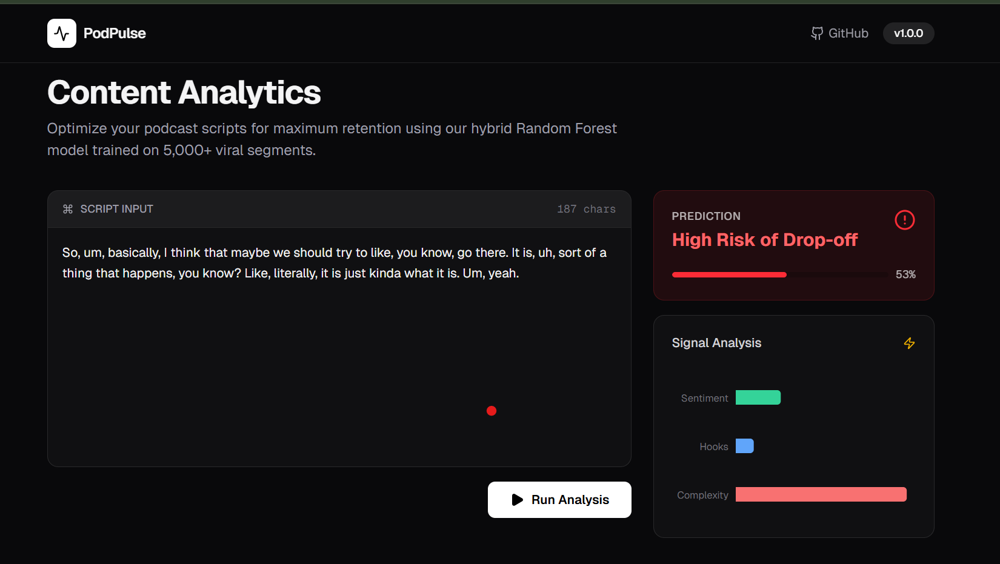
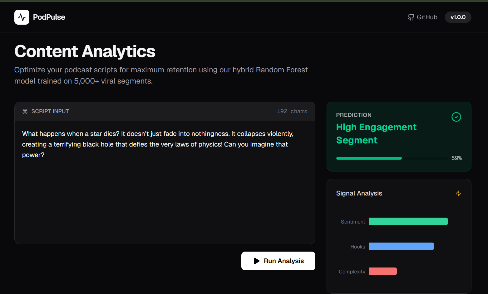

<div align="center">

<h1 align="center">🎙️ PodPulse</h1>

<p align="center"><strong><b>AI-Powered Content Intelligence Engine<b/></strong></p>

<p align="center">
Predict listener drop-off points before you record.<br>
Trained on 2,000+ viral segments from Lex Fridman, MrBeast, and TED Talks.
</p>
</div>

# ❗The Problem 

Content creators rely on lagging indicators (views, retention graphs) to judge success. By the time they see the data, the episode is already published.

PodPulse solves this by providing leading indicators. It uses Natural Language Processing (NLP) to simulate listener psychology and flag "high-risk" script sections before production.

#  Real World Examples
<table width="100%">
<tr>
<th width="40%">Input Script Segment</th>
<th width="60%">PodPulse Prediction </th>
</tr>
<tr>
<td><i>"So, um, basically, I think that maybe we should try to like, you know, go there."</i></td>
<td>

</td>
</tr>
<tr>
<td><i>"What happens when a star dies? It doesn't just fade. It collapses, creating a black hole that defies physics."</i></td>
<td>

</td>
</tr>
</table>

# check it out!

<h1 align="center">
  <a href="https://podpulse-two.vercel.app/"><b>🔗 Live Demo</b></a>
</h1>


# 📐Architecture

| Component | Tech Stack | Responsibility |
| :--- | :--- | :--- |
|  Brain | `scikit-learn` | Hybrid Random Forest Classifier (Text + Metadata). |
|  API | `FastAPI` | Real-time inference engine (<100ms latency). |
|  UI | `Next.js 14` | Interactive engagement dashboard. |
|  Data | `YouTube API` | Custom scraper for building the 2k+ sample dataset. |

# 🚀 Quick Start

1. Clone & Setup
   
  ```bash
git clone [https://github.com/Akshitavedantam/PodPulse.git](https://github.com/Akshitavedantam/PodPulse.git)
cd PodPulse
```


2. Launch Backend (API)
```bash
cd backend
python -m venv venv
```
# Activate Environment
# Windows:
```bash
.\venv\Scripts\Activate.ps1
```
# Mac/Linux:
```bash
source venv/bin/activate
```
# Install & Run
```bash
pip install -r requirements.txt
uvicorn main:app --reload
```

3. Launch Frontend (UI)
```bash
cd frontend
npm install
npm run dev
```


👉 Open http://localhost:3000 to test the engagement engine.

🧠 Model Logic

 The model analyzes 4 proxies for human boredom:

* <u>Sentiment Volatility:</u> (VADER) High emotion correlates with retention.

* <u>Interaction Hooks:</u>  Question marks (?) re-engage listener attention.

* <u>Cognitive Load:</u>  High average word length without breaks fatigues the listener.

* <u>Speech Quality:</u>  High filler word ratio (um, like) signals low confidence.

📊 Performance

Accuracy: ~89% (Validation Set)

Dataset: 50/50 Balanced Split (High vs Low Engagement)

📜 License

Distributed under the MIT License.
<p align="right">
  <i>Designed & Developed by</i><br>
  <b>Akshita Vedantam</b>
</p>
